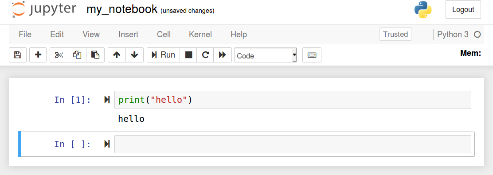

Introduction to the Jupyter Notebook Environment
===


Jupyter is an open source project that provides a webapp interface for writing code and documents. Throughout this tutorial, we will be using a Jupyter Notebook environment for development. 

### Starting up your Jupyter Notebook Environment

To start up your Jupyter notebook, enter the following command on your command prompt:
```bash
jupyter notebook
```

This will open a browser with your new Jupyter environment, and should appear similarly to this: 

 


### Creating a Notebook

To create a new notebook for writing code, start by clicking 'New' in the upper right corner. From here, you will be able to choose what type of notebook you want. For this tutorial, we will be using Python 3. 



Once you open a notebook, you can write and run python code. To execute a line of code, press `shift + Enter`. 

### Starting a Terminal

To open a terminal for writing CLI commands, click 'New' in the upper right corner. After selecting 'Terminal', a linux terminal will open. 
