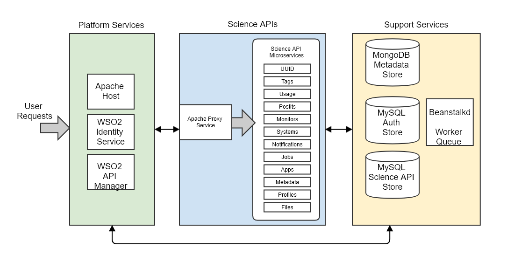
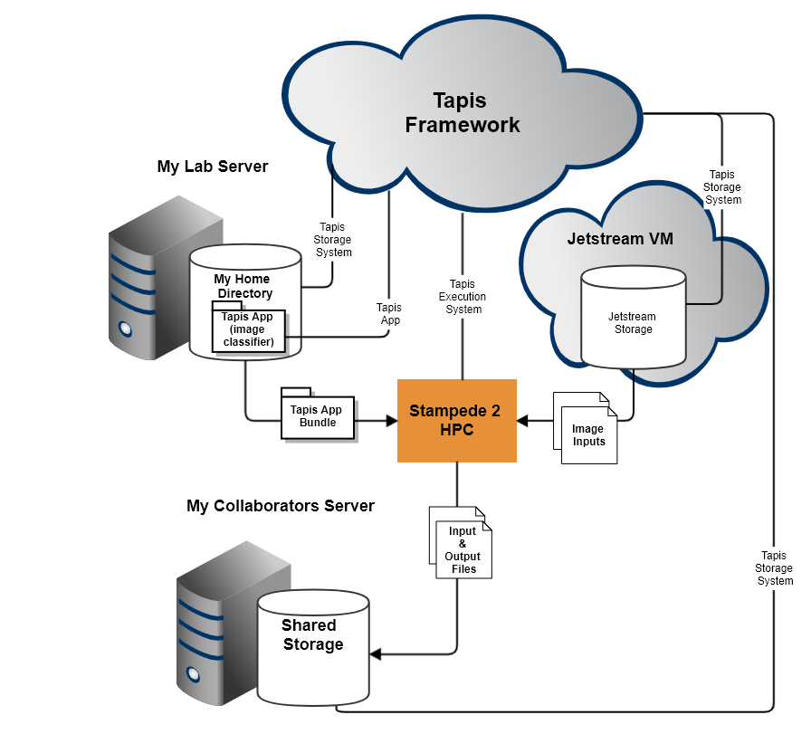

## Tapis Introduction

### Tapis(Formerly Agave) Provides A Cyberinfrastructure Platform For Science Allowing:
​
#### IDENTITY AND ACCESS MANAGEMENT
Leverage OAuth2 and OpenID Connect, the mechanisms in place for controlling and securing access on the web.
#### MANAGE ALL YOUR DATA
Move, share and publish data using any of the multiple data protocols,such as SFTP and gridFTP, supported by the Platform. 
#### RUN CODE
Run apps as batch, interactive, or event-driven processes depending on specific application needs.  Tapis also tracks the provenance of each run so you can look back and see exactly what parameters, inputs and applications were used to generate an output.
#### FIND AND SHARE APPS
Use the growing catalog of publicly available apps or design custom apps.
​

All this is hosted for you, you don't have to stand up your own servers to access any of these features.

### A Number of Science Gateways and projects leverage Tapis:

* [Cyverse](https://cyverse.org)
* [Design-safe](https://www.designsafe-ci.org/#!#research)
* [iMicrobe](https://www.imicrobe.us)
* [VDJ](https://vdjserver.org/)
* [Ike Wai](http://ikewai.org)

All these gateways leverage Tapis to provide access to data, software and compute resources.
​
### Tapis is REST and JSON
​
The Tapis REST APIs enable developers/researchers to create and manage digital laboratories that spans campuses, the cloud, and multiple data centers using a cohesive set of web-friendly interfaces. 
​
That means you can use CURL to access any of the API functions from a command line or scripting environment.
​
### Tapis tools
​
While CURL is straightforward it is not the most handy.  Tapis has additional tools to make using it simplier, such as a Command Line Interface (CLI) and a Python library.
​
These tools make it easier to utilize and build complex workflows and applications with Tapis using some of the programming and scripting skills you may already have.

### Tapis can be simple

You don't have to do a lot of complex things to use Tapis.  If you just want something to automate taking data from one place and moving it to a compute system, run the computation and then move it back with one command from Tapis - you can do that (We will show you how today).  Maybe others in your lab or department want to do the same thing you can share the application and they can run their data against the same software and compute system as well.

Typical Workflow Example

I want to run an image classifier on data from a remote server on a HPC system and archive it to my collaborators/project server.

I’ve told Tapis about all the servers and defined a Tapis “app” beforehand.

To launch this- I tell Tapis which “app” to use, what parameters and input data from what “system” and where to archive using a Tapis “job”

Tapis handles the rest… it moves the input data, app bundle to the HPC, schedules the job, monitors progress and move the Input/Output & logs files to the archive server when the job is completed.  The provenance of the entire process is tracked in a “job” so I can reproduce it later or review all the information about how the output was generated.

​
### Full Tapis Documentation
​
Full documentation and guides for using Tapis can be found here:
<https://tacc-cloud.readthedocs.io/projects/agave/en/latest/index.html>
​
